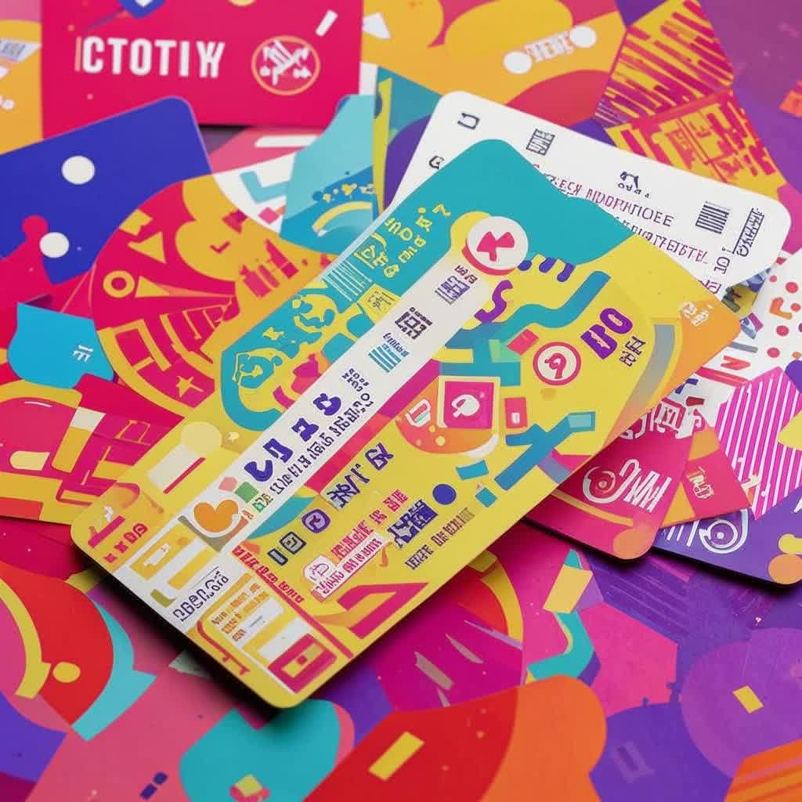
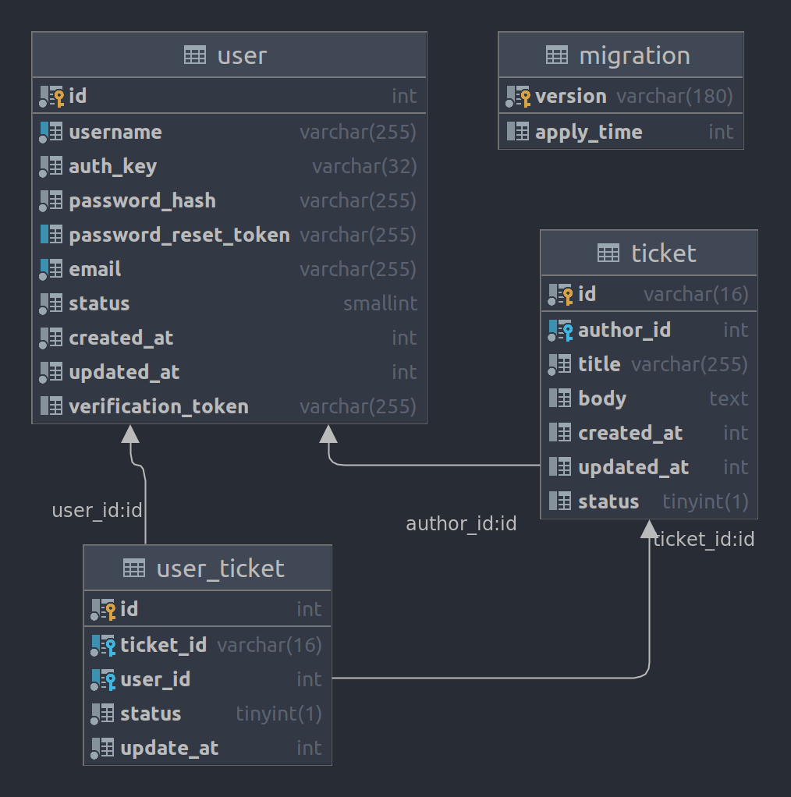
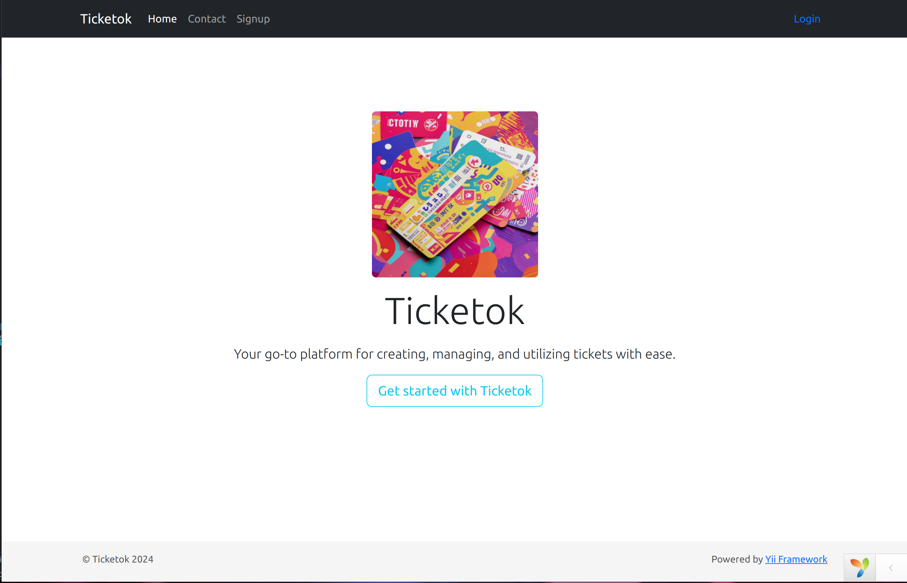
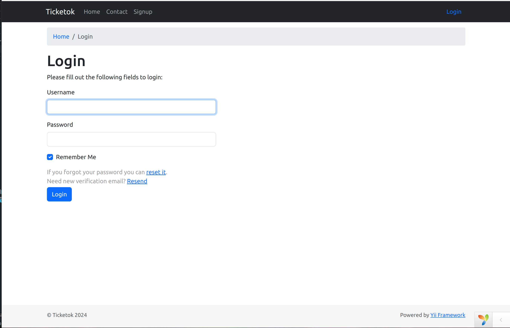
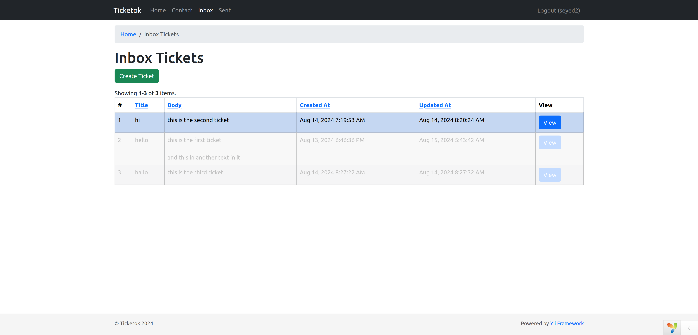
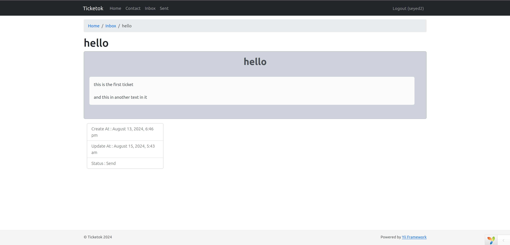
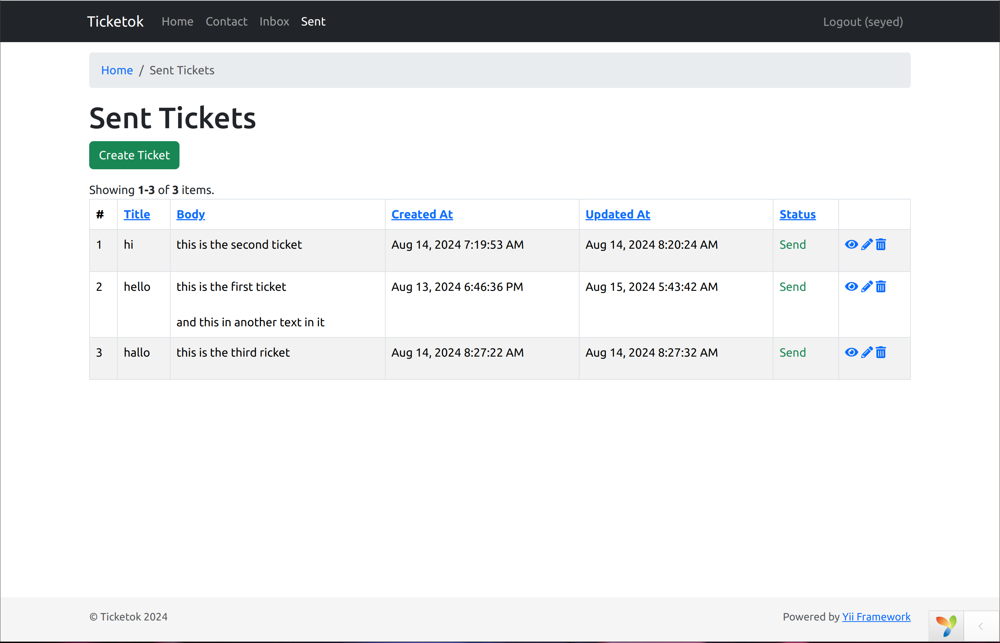
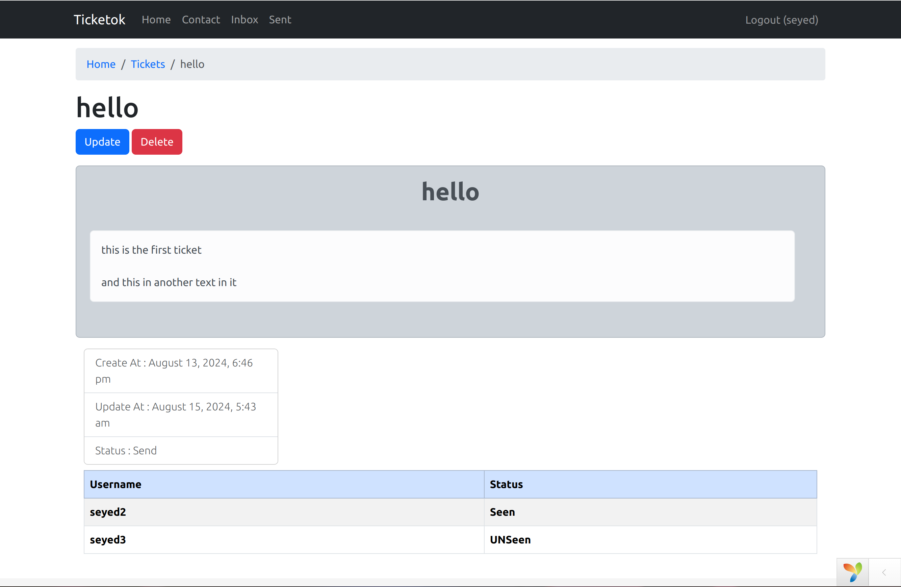
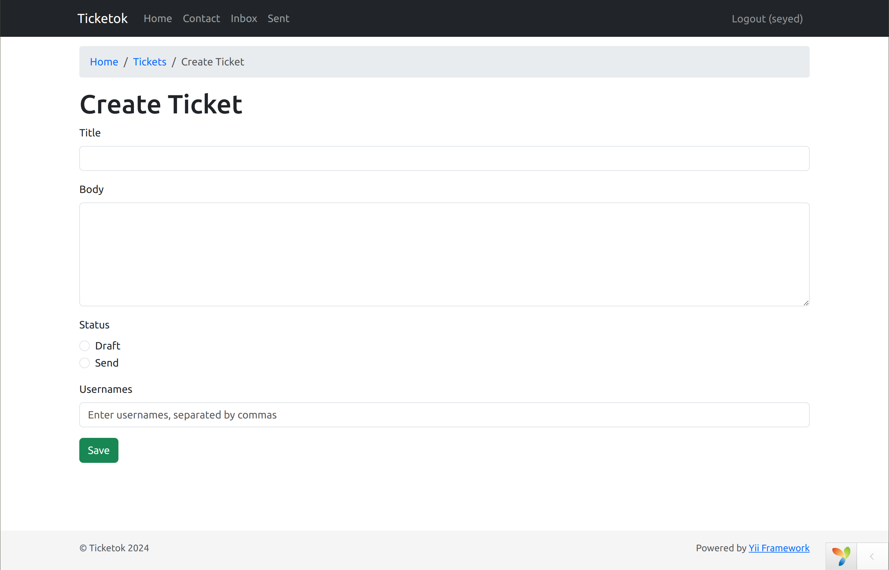
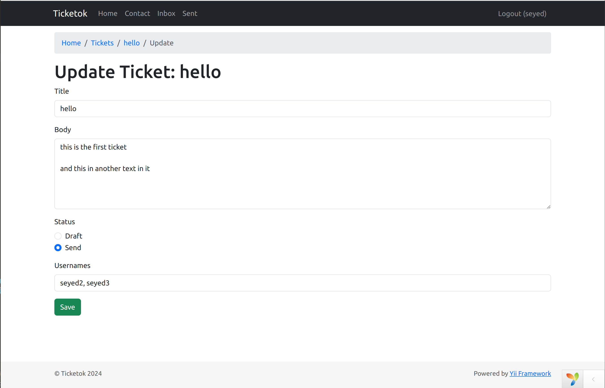

# Ticketok

This project is a web-based ticketing system built using PHP and the Yii2 framework. It is designed to manage and track internal support tickets, facilitate issue resolution, and streamline communication among support teams and other departments within the organization.

## Tech stack

## Database

## Shots

